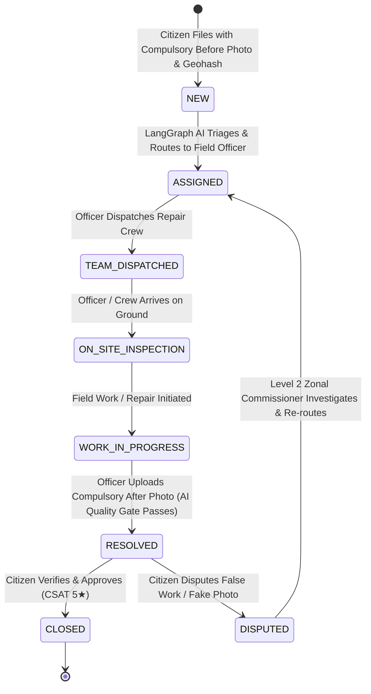

# 🏛️ Jan Setu — Advanced Municipal Grievance Lifecycle & Integrity Systems Blueprint

This document details the architectural plan, database schema, operational workflows, agentic AI verification gates, and future enhancement roadmap for the **Jan Setu Municipal Redressal Platform**.

---

## 1. Executive Summary & Core Objectives

Jan Setu is an enterprise-grade Autonomous Agentic Redressal and Municipal Operations system built for Greater Hyderabad Municipal Corporation (GHMC).

The system addresses the core challenges of civic administration:
1. **Zero Bogus Reports & Accurate Geospatial Routing**: Enforces mandatory premise defect photographs at intake and locks pinpoint coordinates via OpenStreetMap Geocoding and Base32 Geohashing.
2. **Autonomous Multi-Factor Priority Engine**: Eliminates citizen self-selection of priority; priority (Level 1–4) is computed by AI hazard analysis, localized grievance clustering, sensitive landmark proximity, and field inspection findings.
3. **Transparent Intermediary Operations**: Provides granular milestone visibility to citizens (`TEAM_DISPATCHED`, `ON_SITE_INSPECTION`, `WORK_IN_PROGRESS`).
4. **Enforced Ground Truth with AI Quality Gate**: Compulsory repaired premise "After Photo" verified before closure is permitted.
5. **Citizen Negligence Contestation & Disciplinary Tracking**: Disputed resolutions immediately escalate to Level 2 (Zonal Commissioner) and record disciplinary negligence strikes against officer profiles.

---

## 2. End-to-End Operational Lifecycle & Finite State Machine



---

## 3. Detailed Architectural Components

### 📸 A. Compulsory Before vs. After Photo Quality Gate
- **Intake Requirement:** Citizen must attach photographic evidence (`before_image_url`). Forms without photos are blocked at the client and rejected by backend Pydantic validation.
- **Resolution Quality Gate:** In `verification_agent.py`, the AI Quality Gate inspects resolution submissions. If `after_image_url` is missing or invalid, resolution is strictly rejected with an explicit HTTP 400 error.
- **Dual Visual Comparison Viewer:** Side-by-side Before (Citizen Defect) vs. After (Officer Repair) photographs are rendered in citizen and officer tracking interfaces.

### 🗺️ B. OpenStreetMap Geocoding & Precision Geohash Engine (`geoutil.py`)
- **Geohashing Algorithm:** Base32 encoding with 7-character precision (~150m grid box in Hyderabad).
- **Interactive Search:** Integrates OpenStreetMap Nominatim geocoder with real-time address lookup, extracting `latitude`, `longitude`, and computing the zone geohash.
- **Geospatial Clustering:** Enables GIS blackspot detection across municipal wards.

### 🚚 C. Intermediary Crew Progression & Status Milestones
- Officers progress tasks through:
  - `TEAM_DISPATCHED` (Crew en route)
  - `ON_SITE_INSPECTION` (Crew arrived, inspection underway)
  - `WORK_IN_PROGRESS` (Active physical repairs)
- All transitions trigger automated timeline events and localized SMS/push notifications.

### ⚖️ D. Citizen Dispute & Disciplinary Negligence System
- **Contestation Flow:** If an officer submits an improper resolution, citizens can click **"Dispute (False Work)"**.
- **Disciplinary Escalation:**
  - Ticket transitions to `DISPUTED`.
  - Increments officer's `negligence_strikes` in the database.
  - Automatically elevates escalation to **Level 2 (Zonal Commissioner)**.
- **Admin Audit:** Real-time strike count is displayed on officer profile badges in the Staff Directory.

---

## 4. Database Schema Extensions

### `Grievance` Model:
```python
class Grievance(Base):
    # Core Fields
    id = Column(Integer, primary_key=True)
    tracking_id = Column(String(32), unique=True, index=True)
    raw_text = Column(Text, nullable=False)
    status = Column(String(32), default="NEW")
    
    # Photographic Evidence
    before_image_url = Column(Text, nullable=True)
    after_image_url = Column(Text, nullable=True)
    
    # Geospatial Coordinates & Geohash
    latitude = Column(Float, nullable=True)
    longitude = Column(Float, nullable=True)
    geohash = Column(String(16), nullable=True)
    
    # Contestation & Disciplinary Fields
    dispute_reason = Column(Text, nullable=True)
    dispute_image_url = Column(Text, nullable=True)
    disputed_at = Column(DateTime, nullable=True)
    is_negligence_verified = Column(Boolean, default=False)
    
    # Priority & Routing
    priority = Column(Integer, default=3)
    priority_score = Column(Integer, default=50)
    priority_reason = Column(Text, nullable=True)
    sla_deadline = Column(DateTime, nullable=True)
    assigned_officer_id = Column(Integer, ForeignKey("users.id"), nullable=True)
```

### `User` Model (Officer Profile):
```python
class User(Base):
    id = Column(Integer, primary_key=True)
    name = Column(String(128))
    username = Column(String(64), unique=True)
    role = Column(String(32))  # CITIZEN, OFFICER_L1, COMMISSIONER_L2, ADMIN
    department_id = Column(Integer, ForeignKey("departments.id"), nullable=True)
    negligence_strikes = Column(Integer, default=0)
```

---

## 5. Future Roadmap & Advanced Enhancements

```
+-------------------------------------------------------------------------------+
| PHASE 1: COMPLETED                                                            |
|  - LangGraph Multi-Agent Orchestration & Priority Engine                      |
|  - Compulsory Before/After Photo Quality Gate & Nominatim Geohashing          |
|  - Intermediary Milestones & Citizen Negligence Dispute System                |
+-------------------------------------------------------------------------------+
                                      |
                                      v
+-------------------------------------------------------------------------------+
| PHASE 2: COMPUTER VISION & MULTI-MODAL VERIFICATION (FUTURE)                  |
|  - Gemini 1.5 Flash Vision for automatic Defect-to-Repair visual delta score  |
|  - EXIF GPS metadata verification to prevent uploading old stock images       |
|  - Real-time WhatsApp Chatbot Integration via Twilio/Meta Business API        |
+-------------------------------------------------------------------------------+
                                      |
                                      v
+-------------------------------------------------------------------------------+
| PHASE 3: ADVANCED PREDICTIVE GIS & RESOURCE OPTIMIZATION                      |
|  - Predictive Blackspot AI: Monsoon flood forecasting based on elevation      |
|  - Vehicle Routing Optimization (VRP) for municipal maintenance trucks        |
|  - Direct Aadhaar / DigiLocker integration for citizen authentication         |
+-------------------------------------------------------------------------------+
```

---

## 6. Verification & Test Suite Reference

To run full lifecycle verification:
```bash
# In v2/backend directory:
python scratch/test_full_flow.py
```
Expected output confirms:
1. `Grievance Registration` with before-photo & geohash $\rightarrow$ `HTTP 200`
2. `Milestone Progression` (`TEAM_DISPATCHED` $\rightarrow$ `ON_SITE_INSPECTION` $\rightarrow$ `WORK_IN_PROGRESS`) $\rightarrow$ `HTTP 200`
3. `Resolution without After-Photo` $\rightarrow$ Blocked with `HTTP 400`
4. `Resolution with Valid After-Photo` $\rightarrow$ Approved with `HTTP 200`
5. `Citizen Negligence Dispute` $\rightarrow$ Escalated to Level 2 with `HTTP 200` & strike logged.
