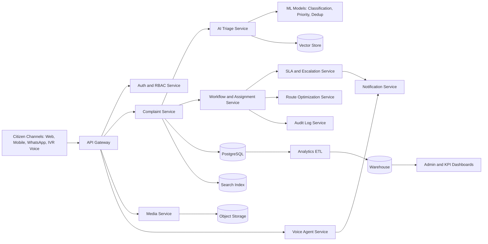

# AI Grievance Redressal System - Design and Architecture (Intermediate)

## 1. Purpose
This document defines the product design, technical architecture, workflows, AI components, and rollout plan for an AI-enabled civic grievance redressal platform (GHMC-like), with two special additions:
1. Voice agents for complaint intake and updates.
2. Map-based route optimization for field officers.

## 2. Product Goals
1. Reduce grievance resolution turnaround time.
2. Improve first-time correct routing to departments.
3. Increase SLA compliance and accountability.
4. Provide transparent status updates to citizens.
5. Improve field productivity through optimized routes.

## 3. User Personas
1. Citizen
2. Call-center executive
3. Field officer
4. Department supervisor
5. Zonal admin or commissioner
6. System admin

## 4. Functional Scope

### 4.1 Complaint Intake
1. Channels: web, mobile, WhatsApp, call center, IVR voice.
2. Input: text or voice, image or video, geolocation, category hints.
3. Output: complaint ticket ID and acknowledgment.

### 4.2 AI Triage
1. Language normalization and translation.
2. Category prediction (sanitation, roads, lighting, drainage, etc.).
3. Priority scoring.
4. Duplicate complaint detection.
5. Department routing recommendation with confidence score.

### 4.3 Workflow and Operations
1. Assignment to ward and department officer.
2. Status lifecycle tracking.
3. Resolution proof upload (photo, video, notes).
4. Reopen and verification flow.
5. SLA timers and escalation matrix.

### 4.4 Citizen Communication
1. Real-time updates via SMS, WhatsApp, push, and email.
2. Voice bot callbacks for status updates.
3. Multilingual response templates.

### 4.5 Analytics and Governance
1. SLA compliance dashboards.
2. Ward-wise and category-wise trends.
3. Officer workload and performance.
4. Heatmaps and recurrence analysis.

## 5. Special Features

### 5.1 Voice Agents
Voice agents operate across inbound and outbound interaction layers.

Use cases:
1. Citizen calls IVR and speaks complaint naturally.
2. Voice-to-text transcription and AI extraction of location and issue type.
3. Agent asks clarifying prompts (landmark, severity, callback consent).
4. Complaint ticket is created and read back to citizen.
5. Outbound voice calls provide status updates (assigned, in-progress, resolved).
6. Missed-call workflow triggers callback bot.

Technical notes:
1. Speech-to-text with multilingual support.
2. NLU for intent and entity extraction.
3. Text-to-speech with localized voice.
4. Human handoff when confidence is low.
5. Full call transcript stored in audit trail.

### 5.2 Map-Based Officer Route Optimization
Optimizes officer movement by clustering and sequence planning.

Use cases:
1. Officer receives daily task route ordered by distance, priority, and SLA urgency.
2. Nearby complaints are batched for one trip.
3. Route dynamically reorders when a new high-priority complaint arrives.
4. Supervisor sees route adherence and delay hotspots.

Optimization objective example:

Minimize:
TravelTime + alpha * SLA_Risk + beta * PriorityPenalty

Inputs:
1. Complaint geocoordinates.
2. Priority and severity.
3. SLA deadlines.
4. Officer shift windows and capacity.
5. Traffic and time-of-day (if available).

Outputs:
1. Ordered stop sequence.
2. ETA per stop.
3. Total route time estimate.
4. Reassignment recommendation if overload detected.

## 6. High-Level Architecture

## 7. Service-Level Design
1. Identity Service: login, roles, access scope by ward and zone.
2. Complaint Service: complaint lifecycle and event timeline.
3. AI Triage Service: NLP and model orchestration.
4. Routing Service: department and ward mapping policy.
5. SLA Service: deadline computation and escalation alerts.
6. Route Optimization Service: batched route plans for officers.
7. Voice Agent Service: IVR orchestration, STT, NLU, TTS, transcripts.
8. Notification Service: omni-channel updates.
9. Analytics Service: KPI APIs and trend reports.
10. Admin Service: master data and policy configuration.

## 8. Data Model (Core Entities)
1. users
2. officers
3. departments
4. wards
5. complaints
6. complaint_events
7. complaint_attachments
8. assignments
9. sla_policies
10. escalation_rules
11. notifications
12. citizen_feedback
13. ai_predictions
14. voice_interactions
15. route_plans
16. route_plan_stops

## 9. Complaint State Machine
1. NEW
2. TRIAGED
3. ASSIGNED
4. ACKNOWLEDGED
5. IN_PROGRESS
6. RESOLVED
7. VERIFICATION_PENDING
8. CLOSED
9. REOPENED
10. ESCALATED

Business rules:
1. Mandatory evidence before RESOLVED.
2. Auto-escalate on SLA breach.
3. All transitions logged in immutable audit events.
4. Reopen allowed for configurable window.

## 10. API Blueprint (Sample)
1. POST /complaints
2. GET /complaints/{id}
3. PATCH /complaints/{id}/status
4. POST /complaints/{id}/attachments
5. POST /ai/triage
6. POST /routing/assign
7. POST /sla/evaluate
8. GET /officers/{id}/tasks
9. POST /routes/optimize
10. GET /routes/{officerId}/today
11. POST /voice/intake
12. POST /voice/callback
13. GET /analytics/kpis

## 11. Non-Functional Requirements
1. Availability target: 99.9 percent.
2. P95 API latency under 400ms for core synchronous flows.
3. Asynchronous processing for AI and media-heavy operations.
4. Strong observability with logs, traces, and metrics.
5. Idempotent write APIs.
6. Horizontal scaling for voice and notification loads.

## 12. Security and Compliance
1. Role-based and geo-scoped access controls.
2. Encryption in transit and at rest.
3. PII masking in dashboards and logs.
4. Immutable audit logs for legal traceability.
5. Abuse protection with rate limiting and spam detection.
6. Data retention and deletion policy compliance.

## 13. KPI Framework
1. Mean time to assign.
2. Mean time to resolve.
3. SLA compliance ratio.
4. Reopen percentage.
5. Duplicate complaint ratio.
6. Officer route efficiency (resolved per km, ETA variance).
7. Voice agent containment rate (no human transfer).

## 14. Phased Roadmap

### Phase 1 (MVP)
1. Multi-channel complaint intake (text and media).
2. AI triage v1 (category and priority).
3. Assignment and SLA tracking.
4. Citizen notifications.
5. Basic dashboards.

### Phase 2
1. Voice agent intake and outbound status bot.
2. Improved duplicate detection.
3. Field officer app with map task view.
4. Route optimization v1.

### Phase 3
1. Dynamic route optimization with live traffic.
2. Image-assisted issue verification.
3. Predictive SLA breach prevention.
4. Advanced governance dashboards and anomaly detection.

## 15. Risks and Mitigation
1. Low model confidence: human review fallback and thresholds.
2. Inaccurate geolocation: landmark-assisted correction prompts.
3. Voice misrecognition in noisy calls: confirmation prompts and DTMF fallback.
4. Route overload due to sudden spikes: auto-reassignment and supervisor override.
5. Adoption risk: officer training and phased rollout by zone.

## 16. Deployment Strategy
1. Start as modular monolith for faster delivery.
2. Split high-load modules (AI, voice, notifications, analytics) into services.
3. Containerized deployment with CI/CD.
4. Blue-green or canary model release strategy.

## 17. Suggested Documentation Structure
1. docs/overview.md
2. docs/architecture.md
3. docs/workflows.md
4. docs/voice-agents.md
5. docs/route-optimization.md
6. docs/data-model.md
7. docs/api-spec.md
8. docs/security-compliance.md
9. docs/roadmap.md
